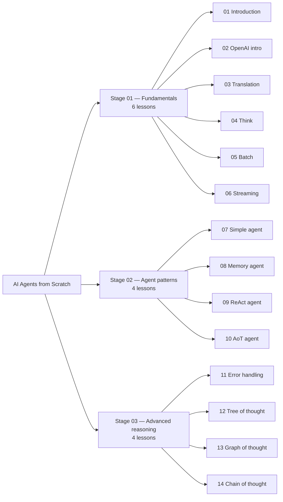
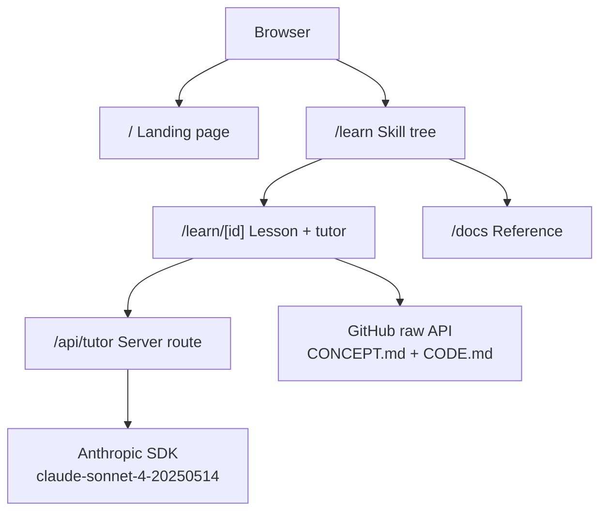

<div align="center">


# agent

**14-lesson Node.js course portal for building AI agents from first principles.**


</div>

A full-stack learning portal for [AI Agents from Scratch](https://github.com/pguso/ai-agents-from-scratch). Each lesson covers one foundational agent pattern — model loading, function calling, memory, ReAct, DAG planning, tree/graph/chain of thought — with an embedded AI tutor backed by Claude.

---

## What it does

- **Skill tree roadmap** — Visual node graph of all 14 lessons grouped into 3 stages. Click any node to jump directly into that lesson.
- **Per-lesson chat tutor** — Server-side Claude integration answers questions in the context of each lesson. API key never touches the browser.
- **GitHub content sync** — Lesson concept and code content is fetched from the upstream repo at build time (ISR, 1-hour revalidation). No manual copy-paste, no stale content.
- **4 pages** — Landing, Branch (roadmap), Chat (per-lesson tutor), Docs (technical reference)

---

## Key features

| Feature | Detail |
|---|---|
| 14 lessons | 3 stages: Fundamentals → Agent patterns → Advanced reasoning |
| AI tutor | Claude Sonnet, server-side only via `/api/tutor` route |
| ISR content | GitHub raw API, `revalidate: 3600` — stays in sync automatically |
| Vercel dark design | Locked token system: `--bg`, `--bd`, `--purple`, `--green` — no deviations |
| Geist fonts | Geist Sans (prose) + Geist Mono (labels, code, breadcrumbs) |

---

## Stages



---

## Architecture



---

## Quick start

```bash
git clone https://github.com/muaddib14/ai-agents-from-scratch
cd ai-agents-from-scratch
npm install

# Add your Anthropic API key
echo "ANTHROPIC_API_KEY=sk-ant-..." > .env.local

npm run dev
```

Open [http://localhost:3000](http://localhost:3000).

---

## Project structure

```
src/
├── app/
│   ├── page.tsx                  ← Landing (/)
│   ├── learn/
│   │   ├── page.tsx              ← Branch — skill tree (/learn)
│   │   └── [id]/page.tsx         ← Chat — lesson + tutor (/learn/[id])
│   ├── docs/page.tsx             ← Technical reference (/docs)
│   └── api/tutor/route.ts        ← Server-side Anthropic route
├── components/
│   ├── shared/TopNav.tsx         ← Navigation bar
│   └── chat/ChatPanel.tsx        ← AI tutor client component
└── lib/
    ├── lessons.ts                ← Lesson metadata + GitHub fetch
    └── tutor.ts                  ← System prompt builder
```

---

## Configuration

| Variable | Description |
|---|---|
| `ANTHROPIC_API_KEY` | Required. Anthropic API key for the tutor route. |

The API key lives in `.env.local` only. It is never bundled into client code.

---

## Lesson map

| # | Title | Tag | Stage |
|---|---|---|---|
| 01 | Introduction | basic llm | Fundamentals |
| 02 | OpenAI intro | hosted llms | Fundamentals |
| 03 | Translation | system prompts | Fundamentals |
| 04 | Think | reasoning | Fundamentals |
| 05 | Batch | parallelism | Fundamentals |
| 06 | Streaming | response control | Fundamentals |
| 07 | Simple agent | function calling | Agent patterns |
| 08 | Memory agent | persistent state | Agent patterns |
| 09 | ReAct agent | reason + act | Agent patterns |
| 10 | AoT agent | atomic planning | Agent patterns |
| 11 | Error handling | resilience | Advanced reasoning |
| 12 | Tree of thought | beam search | Advanced reasoning |
| 13 | Graph of thought | dag merge | Advanced reasoning |
| 14 | Chain of thought | auditable reasoning | Advanced reasoning |

---

## Deployment

### Vercel (recommended)

```bash
# Install Vercel CLI
npm i -g vercel

# Deploy
vercel --prod
```

Set `OPENROUTER_API_KEY` in your Vercel project's Environment Variables dashboard.

### Self-hosted (Node.js)

```bash
npm run build
npm start          # runs on port 3000 by default
```

Requires Node.js 18+. Set `OPENROUTER_API_KEY` in your environment before starting.

### Environment variables

| Variable | Required | Description |
|---|---|---|
| `OPENROUTER_API_KEY` | Yes | OpenRouter API key for the AI tutor route |

---

## Contributing

1. Fork the repo and clone it locally
2. Create a branch: `git checkout -b feature/your-feature`
3. Make your changes with conventional commits: `feat(scope): description`
4. Run tests: `npm test`
5. Open a pull request against `main`

Commit types: `feat`, `fix`, `refactor`, `docs`, `test`, `chore`, `ci`

---

## License

MIT
